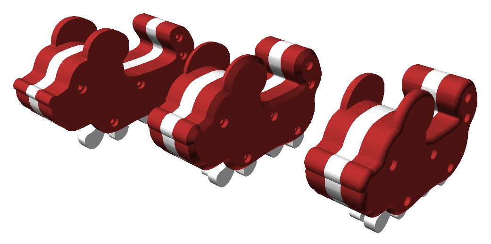

Shield: [![CC BY-NC-SA 4.0][cc-by-nc-sa-shield]][cc-by-nc-sa]
<!-- Thanks to this Guy: https://github.com/santisoler/cc-licenses?tab=readme-ov-file#cc-attribution-noncommercial-sharealike-40-international-->
This work is licensed under a
[Creative Commons Attribution-NonCommercial-ShareAlike 4.0 International License][cc-by-nc-sa].

[![CC BY-NC-SA 4.0][cc-by-nc-sa-image]][cc-by-nc-sa]

[cc-by-nc-sa]: http://creativecommons.org/licenses/by-nc-sa/4.0/
[cc-by-nc-sa-image]: https://licensebuttons.net/l/by-nc-sa/4.0/88x31.png
[cc-by-nc-sa-shield]: https://img.shields.io/badge/License-CC%20BY--NC--SA%204.0-lightgrey.svg

# Walking Dog 3D Model
<p align="center" width="100%">
    
</p>

A 3D model of a walking dog toy. The model was designed for producing on a 3D printer.

⚠️ **In case of any questions** – do not hesitate to contact the author in Telegram group ([see below](#contact-me)) and ask.


## HOWTO

⚠️ Before assembling read the topic to the bottom!

This 3D model is highly customizable. So you can configure it for you needs.


### Pre-rendered STL

If you do not need any customizations and would only like to have the same "Walking dog" toy as I have – you can download prerendered STL files from Thingiverse: 
 * https://www.thingiverse.com/thing:6499100 - angular version;
 * https://www.thingiverse.com/thing:6572654 - version with rounding or chamfer.

**But do not be in hurry and read the manual there as well**. First of all print only the test figures and check if your fasteners and shafts fit well.

In case the test figures are not fit or you would like to customize the walking dog – you can "polish" the model's parameters.

### Model Parameters

I used self-explanatory names for OpenSCAD model parameters. But if you still have any questions – [contact me](#contact-me).

⚠️ **Pay attention:**

1) There are two modes: *"Preview"* and *"Producing"*. See *"General"* -> *"renderingType"* parameter. *"Preview"* allows to see the toy as if it was assembled. **If you are going to print parts** – choose *"Producing"*;

2) To have **the wide paws** :
    * Select the preset *"Wide Paws"* (See on the top of *"Customizer panel"*). **But in this case all your parameter changes will be reset to defaults**;
    * Play with parameters *"wheelSpacerHeight"* and *"wheelSpacerDiameter"* from the *"Wheels"* group;

3) If you'd like to have **the rounded corners or chamfers** on the model - there are two parameters (see the *"General"* group):
    * *"rounding"*  – rounding type. **It takes too much time** to apply the effect. So, adjust any other parameters and apply either rounding or chamfer at the latest stage. And take some coffee 😉. Possible values:
        |Value|Description|Correct name as for real engineers|Takes time to apply|
        |--|--|--|--|
        |*"Off"*|Neither rounding or chamfer|-|Less than a second|
        |*"Cone"*|Conical rounding|**Chamfer**|~25 minutes|
        |*"Sphere"*|Spherical rounding|**Rounding**|~45 minutes|
    * *"roundingRadius"* – rounding radius / chamfer height (depending on selected value of the *"rounding"* parameter);


After modifying parameters look in OpenSCAD Console. Calculated debugging values were added there:

```
ECHO: "Results: "
ECHO: "  Scale factor: ", 0.200348
ECHO: 
ECHO: "  Wheel: "
ECHO: "      Diameter: ", 42.4739
ECHO: "      Spacer wall thickness: ", 1.65
ECHO: "      Width: ", 4.2
ECHO: 
ECHO: "  Side: "
ECHO: "      Total length: ", 112
ECHO: "      Total height: ", 66.0701
ECHO: 
ECHO: "  Others: "
ECHO: "      Total width: ", 21
ECHO: "      Screw rod length: ", 18.6
```
They are YAML-like and hierarchically grouped. So you can customize the model for your needs and see the results in the Console log.


### Print Settings

Here is an example of my **printing parameters**:

|Name|Value|Comment|
|--|--|--|
|Nozzle diameter|0.4 mm|0.5, 0.6 and even 1 mm could could also be fine. Try!|
|Layer height/First layer height|0.2 mm|It can be any from 0.8 up to 2.4 mm and (may be) even more. So everything is up to You!|
|Perimeters|3|3 is enough but 4 for wheels can be better 🧔|
|Solid layers - top/bottom|6||
|Fill density|25%|15% should be enough but I wanted to have more solid toy|
|Fill pattern|Cubic|It is not critical|
|Supports|Not needed|The model was designed to be printed without any supports|
|Filament|CoPET(PETG)|PLA or ABS would would also be fine. I'd also like to try FLEX for paws (but haven't checked it yet)|

It is just an example. So you can play with yours 🙂. 

It took me around 6.5 hours to print (in general around 8 hours) on my Graber i3 printer. Printing time depends on kind on printer and the printing parameters. 


### Assembling

To assemble the walking dog you will need the next **Tools and Materials**: 

|Name|Quantity|Comment|
|--|--|--|
|Drill bit ⌀ 3 mm(?)|1|In my case it was not required|
|Drill bit ⌀ 3.2 mm|1|To drill paw shafts|
|Drill bit ⌀ 4.5-4.8 mm|1|To polish paw holes|
|Drill|1|Even a primitive one because it will be used for drilling plastic parts only|
|PTFE tube ⌀ 4 mm or a gel pen refill ⌀ ~4.3 mm|1|It will be used for the paw-wheels shaft. **PTFE tube is much better** but a pen refill can be used instead|
|M3 x 20 screws|5||
|M3 nuts|5||
|Screw driver|1||
|File|1|To shorten the screws|
|Filament| ~ 65 - 70 g | With different(?) colours|
|3D printer|1| Or a friend with a 3D printer 😉|


⚠️ If you have everything from the table above **follow the next assembling video manual(-s)**: 

|URL|Description|
|--|--|
|https://youtu.be/4ERVy12Y__E|**REQUIRED!** The root assembly manual. It contains the main principles / approaches  |
|https://youtu.be/j4FVfsxbM0o|**OPTIONAL!** Watch if You prefer the wide paws as I do. 🙂|
|https://youtu.be/0HYvyKCRPyY|**OPTIONAL!** But if you'd like to have a toy with rounding or chamfer - **REQUIRED!** |


Yeah, they are both in Russian but there are English subtitles too. I tried to do my best translating them to English. But if you see something could be fixed - [let me know](#contact-me) please and I will update the text. The same for text here as well. Thank you in advance!


## Contact me
To follow the progress go to my channels:
  - Telegram: [https://t.me/YarickWorkshop](https://t.me/YarickWorkshop/316)
  - YouTube: https://www.youtube.com/@yarick-workshop

Yeah, they both are in Russian.

**If you have any questions** – contact me in either Telegram channel (see above) or Mail: techno.man.983@gmail.com. I can communicate in English without any problems. 

⚠️ **Pay attention**: I do not answer to any comments on YouTube (despite I read them). Why? It is a HUGE secret 🙃
